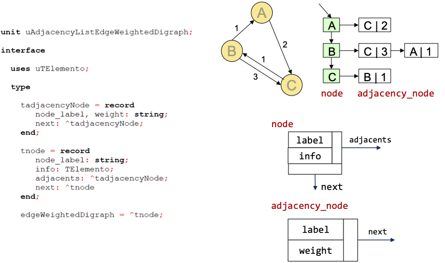

# Ejercicios de Grafos
### Información del Proyecto
| Descripción | Detalles |
|---------------|------------------------------------|
| Profesores | Sergio Cavero y Salvador Sánchez |
| Asignatura | Estructuras de Datos |
| Universidad | Universidad Rey Juan Carlos |
| Curso | 2024/2025 |

# Ejercicio 1: Implementación de métodos básicos de consulta de un grafo
En estos ejercicios vamos a trabajar con un grafo dirigido y ponderado. Para ello, vamos a utilizar los dos siguientes ficheros:
- `uMatrixEdgeWeightedDigraph.pas`: implementación de un grafo dirigido y ponderado.
- `ejercicio1.pas`: programa principal que utiliza la implementación del grafo y que contiene distintos métodos para comprobar su funcionamiento.
- `uListaEnlazadaDoble.pas`: implementación de una lista doblemente enlazada que se utilizará para almacenar los nodos adyacentes.

## Ejercicio 1.1: Echa un vistazo al programa principal
En el programa principal `ejercicio1.pas` se encuentran los siguientes métodos de prueba, diseñados para verificar el correcto funcionamiento de las operaciones básicas del grafo.
No te preocupes si no entiendes alguna de las funciones, en los siguientes ejercicios se explicarán en detalle. Por ahora, solo asegúrate de que entiendes los casos de prueba, el programa compila y se ejecuta correctamente, aunque aparezca algún mensaje de que algún método no está implementado.

### Métodos de prueba incluidos:
1. **`TestInitialize`**  
   Comprueba que el grafo se inicializa correctamente:
   - El número de nodos es 0.
   - La matriz de adyacencia está vacía.
   - El grafo está vacío (`is_empty`).

2. **`TestAddNodes`**  
   Verifica la funcionalidad de añadir nodos:
   - Se pueden añadir nodos al grafo.
   - No se permiten nodos duplicados.
   - El número de nodos se actualiza correctamente.
   - Comprueba si un nodo específico está en el grafo (`node_in_graph`).

3. **`TestAddEdges`**  
   Comprueba la funcionalidad de añadir arcos dirigidos:
   - Se pueden añadir arcos entre nodos existentes.
   - Los pesos de los arcos se asignan correctamente.
   - Verifica la existencia de arcos (`edge_in_graph`) y sus pesos (`edge_weight`).

4. **`TestAdjacent`**  
   Verifica si dos nodos son adyacentes:
   - Comprueba si existe un arco dirigido entre dos nodos (`adjacent`).

5. **`TestDegrees`**  
   Calcula los grados de los nodos:
   - Grado de entrada (`indegree`).
   - Grado de salida (`outdegree`).
   - Grado total (`degree`).

6. **`TestWeightedDegrees`**  
   Comprueba los grados ponderados de los nodos:
   - Grado de entrada ponderado (`weighted_indegree`).
   - Grado de salida ponderado (`weighted_outdegree`).

7. **`TestDeleteEdgeAndNode`**  
   Verifica la funcionalidad de eliminación:
   - Se pueden eliminar arcos entre nodos.
   - Se pueden eliminar nodos del grafo.
   - La matriz de adyacencia y las etiquetas de los nodos se actualizan correctamente.

8. **`TestSelfLoops`**  
   Comprueba si el grafo detecta bucles:
   - Verifica si algún nodo tiene un arco dirigido hacia sí mismo (`has_self_loops`).

9. **`TestDensity`**  
   Calcula la densidad del grafo:
   - Comprueba si la densidad se calcula correctamente (`density`).

10. **`TestIsComplete`**  
    Verifica si el grafo es completo:
    - Comprueba si el grafo es completo (`is_complete`).

11. **`TestNeighbors`**  
    Comprueba los vecinos de un nodo:
    - Obtiene la lista de nodos adyacentes a un nodo dado.
    - Verifica que la lista de vecinos sea correcta.

## Ejercicio 1.2: Implementación de funciones de grado
Para este ejercicio, debes implementar las siguientes funciones:

a) **Grado de salida**
```pascal
function outdegree(var g: edgeWeightedDigraph; node: string): integer;
```
Esta función cuenta el número de arcos que salen del nodo especificado.

b) **Grado de entrada** 
```pascal
function indegree(var g: edgeWeightedDigraph; node: string): integer;
```
Esta función cuenta el número de arcos que llegan al nodo especificado.

c) **Grado total** 
```pascal
function degree(var g: edgeWeightedDigraph; node: string): integer;
```
Esta función calcula la suma de los grados de entrada y salida del nodo especificado.

## Ejercicio 1.3: Implementación de funciones de grado ponderado
Para este ejercicio, debes implementar las siguientes funciones:

a) **Grado de entrada ponderado** 
```pascal
function weighted_indegree(var g: edgeWeightedDigraph; node: string): integer;
```
Esta función calcula la suma de los pesos de los arcos que llegan al nodo especificado.

b) **Grado de salida ponderado** 
```pascal
function weighted_outdegree(var g: edgeWeightedDigraph; node: string): integer;
```
Esta función calcula la suma de los pesos de los arcos que salen del nodo especificado.

## Ejercicio 1.4: Verificación de bucles
Para este ejercicio, debes implementar la siguiente función:

```pascal
function has_self_loops(g: edgeWeightedDigraph): boolean;
```
Esta función debe verificar si algún nodo del grafo tiene un arco dirigido hacia sí mismo (un bucle).

## Ejercicio 1.5: Cálculo de la densidad del grafo
Para este ejercicio, debes implementar la siguiente función:

```pascal
function density(g: edgeWeightedDigraph): real;
```
Esta función debe calcular la densidad del grafo, que se define como la proporción entre el número de arcos existentes y el número máximo posible de arcos en un grafo dirigido (n*(n-1)).

## Ejercicio 1.6: Verificación de grafo completo
Para este ejercicio, debes implementar la siguiente función:

```pascal
function is_complete(g: edgeWeightedDigraph): boolean;
```
Esta función debe determinar si el grafo es completo, es decir, si existe un arco entre cada par de nodos distintos.

## Ejercicio 1.7: Lista de vecinos de un nodo
Para este ejercicio, debes implementar el siguiente procedimiento:

```pascal
procedure neighbors(g: edgeWeightedDigraph; node: string; var lista: tListaDoble);
```
Este procedimiento debe crear una lista con todos los nodos adyacentes (vecinos) al nodo especificado.

Para hacer este ejercicio necesitaras utilizar la estructura de datos `tListaDoble` que se encuentra en el fichero `uListaEnlazadaDoble.pas`. Esta estructura es una lista doblemente enlazada que permite almacenar los nodos adyacentes de forma ordenada. Echa un vistazo a su interfaz para entender cómo funciona y utiliza los métodos que necesites para implementar el procedimiento `neighbors`.


# Ejercicio 2: Implementación de un grafo no dirigido y ponderado (Avanzado)
En estos ejercicios vamos a crear nuestro propio grafo ponderado y no dirigido. Para ello, vamos a utilizar los siguientes ficheros:
- `ejercicio2.pas`: programa principal que utiliza la implementación del grafo y que contiene distintos métodos para comprobar su funcionamiento.
- `uListEdgeWeightedGraph.pas`: nos proporciona la interfaz de un grafo no dirigido y ponderado. Debes ser tú quien implemente la funcionalidad de este grafo. 
- `uListaEnlazadaSimple.pas`: deberás basarte en esta estructura para implementar el grafo. Concretamente, necesitarás crear dos listas. Una lista de nodos y una lista de nodos adyacentes para cada nodo. Deberás modificar este fichero para adaptarlo a tus necesidades, seguramente necesitarás añadir nuevos métodos.

Una vez que hayas implementado el grafo, deberás probarlo con el programa `ejercicio2.pas`. Este programa contiene varios métodos de prueba que verifican el correcto funcionamiento de las operaciones básicas del grafo. Asegúrate de que todos los métodos de prueba se ejecutan correctamente y que el grafo se comporta como se espera.

Una posible de implementación de este grafo se podría basar en la estructura de los nodos presentada en la siguiente imagen. 



Sin embargo, puedes optar por una implementación diferente si lo prefieres. Lo importante es que el grafo funcione correctamente y pase todas las pruebas del programa `ejercicio2.pas`.